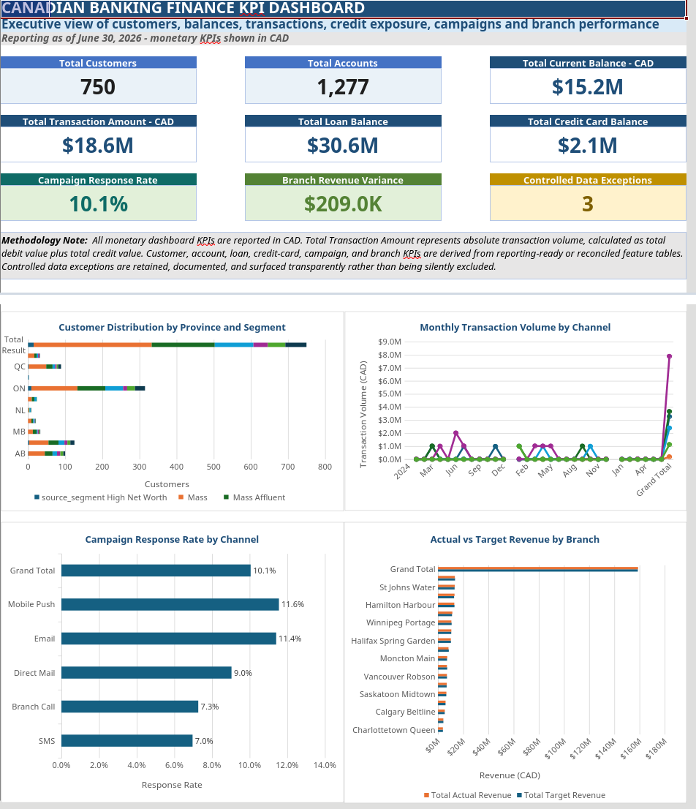

# Canadian Banking Analytics in Excel

### Data quality, reconciliation, statistical analysis and executive reporting

An end-to-end Excel portfolio project that transforms synthetic banking data into validated reporting tables, financial KPIs and management recommendations.

**10,766 source rows · 7 operational datasets · 43 duplicate rows removed · 26 reconciliation controls**

**Tools:** Microsoft Excel · Power Query · PivotTables · PivotCharts · Analysis ToolPak

> Independent portfolio demonstration using fictional Canadian banking data. Results describe the synthetic dataset, not a real bank. This repository contains documentation and screenshots; the workbook is available on request.

[Business problem](#business-problem) · [Data controls](#data-quality-and-reconciliation) · [Findings](#selected-findings) · [Statistical analysis](#statistical-analysis) · [Screenshots](#screenshots)

## Business problem

A banking analytics team needs reliable customer, account, transaction and branch data before producing management reports. This project answers five questions:

- Where are customers, balances and lending exposures concentrated?
- Which branches are above or below revenue targets?
- Which campaign channels show stronger response rates?
- Which records should be excluded from reporting but retained for investigation?
- What do statistical comparisons and a short-term revenue baseline suggest?

I developed a workbook covering source profiling, Power Query cleaning, reconciliation, feature engineering, PivotTable analysis, statistical interpretation and executive reporting.

## Dataset and scope

**Reporting date:** June 30, 2026. Branch analysis covers **540 branch-month observations**.

| Raw dataset | Source rows |
|---|---:|
| Customers | 768 |
| Accounts | 1,287 |
| Transactions | 5,225 |
| Loans | 496 |
| Credit cards | 600 |
| Campaign responses | 1,850 |
| Branch monthly performance | 540 |
| **Total** | **10,766** |

Branch, product and province lookup tables support relationship validation. Source rows include duplicates and records subsequently excluded from reporting; they are not unique-customer counts.

## Workflow

1. **Define:** document business questions, table grain, keys and quality rules.
2. **Profile:** identify duplicate IDs, missing values, inconsistent formats and relationship issues.
3. **Clean:** use Power Query to standardize fields, validate lookups and remove documented duplicate copies.
4. **Control:** separate raw, cleaned and reporting layers; retain exceptions while excluding invalid relationships from reporting.
5. **Reconcile:** compare row counts and financial totals against documented adjustments.
6. **Engineer:** create customer bands, account activity indicators, transaction summaries, lending risk indicators, card utilization, campaign metrics and branch variances.
7. **Communicate:** build PivotTables, statistical analyses, a KPI dashboard and recommendations.

Power Query supports repeatable preparation. Analysis ToolPak outputs are static and must be rerun after material source-data changes.

## Data quality and reconciliation

| Control status | Count |
|---|---:|
| Passed | 18 |
| Passed with expected adjustment | 5 |
| Controlled exceptions | 3 |
| Failed | 0 |
| **Total controls** | **26** |

Customer rows decreased from **768 to 750** and transaction rows from **5,225 to 5,200**, removing **18 customer duplicates and 25 transaction duplicates**.

Controls validate record counts, duplicate treatment, relationship integrity, expected exclusions and financial totals. The reporting layer excludes 10 orphan accounts and 402 transactions with invalid account/customer relationships.

**Zero failed controls does not mean every source record is valid.** Three exception categories remain documented. These categories can overlap and should not be summed as unique affected-record counts.

[View reconciliation checks](screenshots/reconciliation_checks.png)

## Dashboard metrics

| Synthetic portfolio metric | Reported value |
|---|---:|
| Customers | 750 |
| Reporting accounts | 1,277 |
| Current account balance — CAD | $15.2M |
| Absolute transaction volume — CAD | $18.6M |
| Loan balance | $30.6M |
| Credit card balance | $2.1M |
| Campaign response rate | 10.1% |
| Branch revenue variance | +$209.0K |
| Controlled exception categories | 3 |

Monetary dashboard KPIs are presented in CAD. Account and transaction metrics use the documented CAD scope where multiple currencies exist. Transaction volume is absolute debit value plus absolute credit value—not net cash flow or revenue. Branch variance is actual revenue minus target revenue across the reporting period.

Reconciliation totals can use different data layers and signed amounts, so they should not be compared directly with absolute dashboard transaction volume.

## Selected findings

| Finding in the synthetic data | Proposed management response |
|---|---|
| Ontario represents 42.0% of customers | Review geographic concentration when planning customer coverage |
| The Mass segment accounts for 42.4% of customers | Use segment profiles to inform product and campaign planning |
| Weighted card utilization is 33.8% | Review utilization alongside delinquency indicators |
| Mobile Push has the highest response rate, at 11.6% | Compare response and spending outcomes before reallocating resources |
| Quebec Sainte-Foy has the largest positive cumulative revenue variance, approximately $344,206 | Compare variance with achievement frequency and branch context |
| Three exception categories remain controlled | Preserve exclusions and rerun reconciliation at each refresh |

These are analytical findings and recommendations, not measured improvements achieved by a real business.

## Statistical analysis

| Method | Evidence | Interpretation boundary |
|---|---|---|
| Descriptive statistics and histogram | Strongly right-skewed transaction values | Investigate extreme values before treating them as errors |
| Correlation | Associations among customer financial attributes | Correlation does not establish causation |
| Multiple regression | Adjusted R² ≈ 0.932; 540 branch-month observations; target revenue is the only significant predictor in the fitted model | In-sample fit is not proof of forecast accuracy or causal impact |
| Welch's t-test | Average recorded spending uplift: $187.05 for responders versus $17.28 for non-responders; p < 0.001 | Observational comparison, not a randomized campaign-effect estimate |
| One-way ANOVA | Provincial differences: F(9, 530) = 36.660; p < 0.001 | Repeated branch observations weaken independence assumptions; pairwise comparisons need further testing |
| Three-month moving average | Smoothed monthly revenue | Descriptive trend monitoring |
| Exponential smoothing | July 2026 baseline ≈ $5.41M; historical MAPE ≈ 3.3% across 29 comparison periods | Historical one-period errors, not an independently held-out accuracy guarantee |
| Rank and percentile | Cumulative branch revenue ranking | Does not adjust for branch size, costs or market potential |

The smoothing baseline does not explicitly model seasonality, structural changes or external drivers. Regression inference also warrants caution because observations repeat across branches over time.

## Screenshots

### Finance KPI dashboard

### Supporting evidence

| Screenshot | What to review |
|---|---|
| [Reconciliation checks](screenshots/reconciliation_checks.png) | Control outcomes, adjustments and exceptions |
| [Executive summary](screenshots/executive_summary.png) | Findings, recommendations and methodology |
| [Pivot analysis](screenshots/pivot_analysis.png) | Customer, product, channel, lending and branch comparisons |
| [Statistical analysis](screenshots/toolpak_statistical_analysis.png) | Tests, models, smoothing and interpretation |

Open the images for the full-resolution view.

## Current presentation limitations

The screenshots preserve the current workbook output. Several charts include **Grand Total** alongside individual months, branches or segments. The transaction chart's final total creates an apparent spike that is not a monthly observation. Interpret the KPI cards and underlying tables separately from those chart artifacts.

Some executive-summary text is clipped, and long analysis screenshots require zooming. Removing totals from chart source ranges and re-exporting fully expanded report sections are presentation improvements still to complete.

## Workbook organization

| Area | Workbook sections |
|---|---|
| Documentation | Scope, data dictionary, quality rules, source inventory, profiling and cleaning log |
| Data preparation | Dataset-specific raw, profiled and cleaned sheets; reporting layers for accounts and transactions |
| Validation | Reconciliation checks and documented exceptions |
| Features | Customer, account, transaction, loan, card, campaign and branch features |
| Analysis | Pivot analysis and ToolPak statistical analysis |
| Reporting | Finance KPI dashboard, executive summary and skill coverage matrix |

## Repository contents and access

This repository includes **README.md** and five images in **screenshots/**. The full Excel workbook is intentionally not published.

A workbook walkthrough or copy can be requested for an interview or technical review. Screenshots demonstrate outputs but do not make the calculations and transformations independently reproducible.

## Author

**Namarshi Palit**  
[LinkedIn](https://www.linkedin.com/in/namarshi-palit-1a9534186) · [GitHub portfolio](https://github.com/namarshi-data)

*Independent project with no affiliation to a Canadian bank or financial institution. No real customer or confidential banking data is included.*
